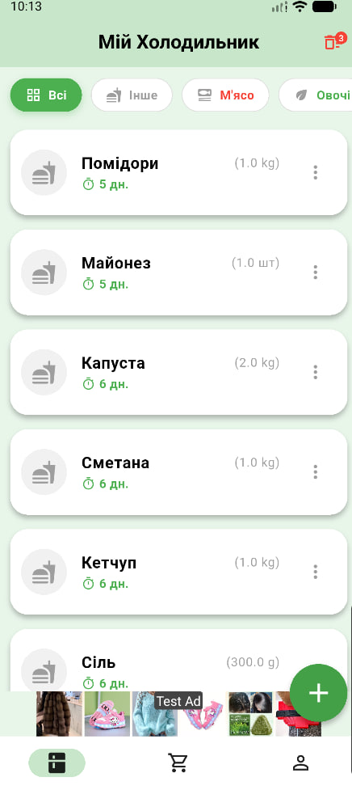

# 🍎 Fridgify

**Fridgify** — це твій розумний еко-помічник для кухні. Додаток допомагає керувати продуктами, зменшувати кількість харчових відходів, економити гроші та координувати сімейні покупки. Використовує передовий ШІ для створення рецептів із того, що є у вашому холодильнику.

---

## 📱 Скріншоти

|                Головний екран                 |                                     Список покупок                                     |                 Рецепти від ШІ                  |                   Статистика                   |
|:---------------------------------------------:|:--------------------------------------------------------------------------------------:|:-----------------------------------------------:|:----------------------------------------------:|
|  |  |  |  |

---

## ✨ Основні можливості

### 🥦 Розумний Холодильник
* **Облік продуктів:** Додавання з фото, категорією, кількістю та терміном придатності.
* **Контроль свіжості:** Кольорова індикація (🟢 свіже, 🟠 скоро зіпсується, 🔴 прострочено).
* **Смітник:** Можливість відновлення видалених продуктів або їх переміщення у список покупок (аналіз втрат).

### 👨‍🍳 AI Шеф-кухар (GPT-4o)
* **Розумний пошук:** Генерує 5 унікальних рецептів на основі обраних продуктів.
* **Фото страв:** Автоматичний підбір реалістичних зображень готових страв.
* **Деталізація:** Калорійність, час приготування, покрокова інструкція та список відсутніх інгредієнтів.

### 🛒 Розумний Список Покупок
* Синхронізація списку в реальному часі для всієї сім'ї.
* **Швидкі дії:** Свайп вліво — купив (у холодильник), свайп вправо — видалити.
* Підтримка різних одиниць виміру (шт, кг, л, мл).

### 👨‍👩‍👧‍👦 Сімейний доступ (Premium)
* Створення "Дому" та запрошення рідних за унікальним кодом.
* Спільний холодильник та список покупок.
* **Сімейний чат:** Вбудований месенджер з підтримкою **голосових повідомлень** та фото.

### 📊 Еко-Статистика та Допомога
* Аналіз ефективності: графіки врятованих (з'їдених) та втрачених (зіпсованих) продуктів.
* **FAQ:** Вбудований розділ з відповідями на часті запитання.
* **Геолокація:** Швидкий пошук вашого місцезнаходження на карті.

---

## 💎 Монетизація та Premium

Додаток використовує гібридну модель монетизації:

1.  **Freemium (Безкоштовно):**
    * Базовий доступ до функцій.
    * Рекламні банери (AdMob).
    * Ліміт на пошук рецептів (перші 3 без реклами, далі — за перегляд відео).
2.  **Premium Підписка (Google Play Billing):**
    * 🚫 Повна відсутність реклами.
    * ♾️ Безлімітний пошук AI рецептів.
    * 👨‍👩‍👧‍👦 Доступ до сімейного функціоналу.
    * 🧠 Найрозумніша модель ШІ.

---

## 🛠 Технологічний стек

* **Core:** Flutter (Dart).
* **Backend:** Firebase (Firestore, Auth, Storage).
* **AI:** OpenAI API (GPT-4o mini) + Image Search API.
* **Monetization:** * `google_mobile_ads` (Banner & Interstitial).
    * `in_app_purchase` (Subscriptions).
* **Features:** * `flutter_sound` (Audio recording).
    * `geolocator` & `url_launcher` (Maps).
    * `fl_chart` (Statistics).
* **Localization:** 5 мов (🇺🇦 UA, 🇺🇸 EN, 🇪🇸 ES, 🇫🇷 FR, 🇩🇪 DE).

---

## 👨‍💻 Розробник

Цей проект розроблено та підтримується **Pavlito**.

* **GitHub:** [Pavlitoo](https://github.com/Pavlitoo)
* **Email:** pasalugovij@gmail.com

---

  Розроблено з ❤️ в Україні 🇺🇦

