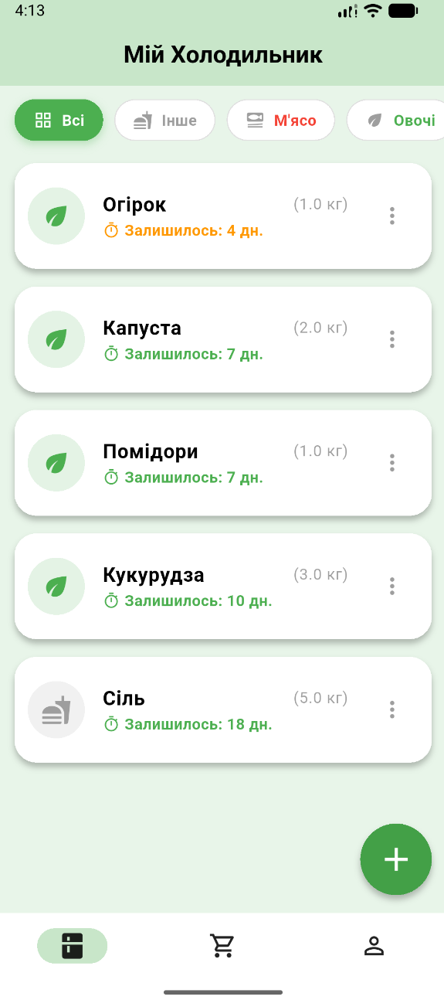
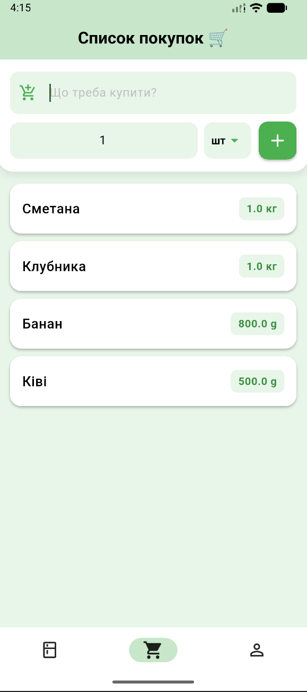
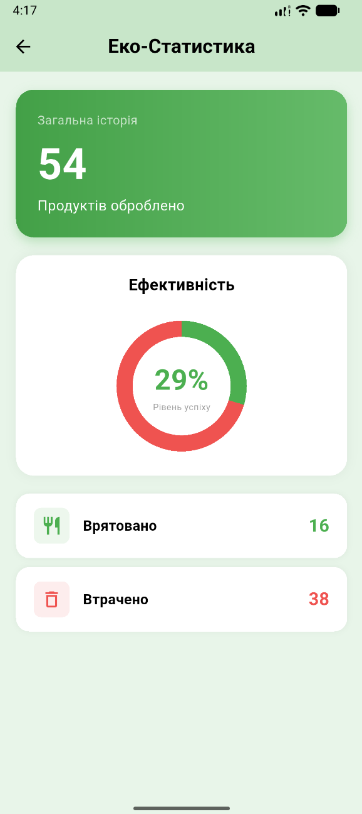

# 🍎 Fridgify


**Fridgify** — це твій розумний помічник для кухні. Додаток допомагає керувати продуктами, зменшувати кількість харчових відходів та координувати сімейні покупки. Використовує штучний інтелект для створення рецептів з того, що є у вас в холодильнику.

---

## 📱 Скріншоти

| Головний екран | Список покупок | Сім'я та Чат | Статистика |
|:---:|:---:|:---:|:---:|
|  |  |  |  |

*(Додайте ваші скріншоти у папку `screenshots` в корені проєкту)*

---

## ✨ Основні можливості

### 🥦 Розумний Холодильник
* Додавання продуктів з вибором категорії, кількості та терміну придатності.
* Відстеження свіжості продуктів (кольорова індикація: 🟢 свіже, 🟠 скоро зіпсується, 🔴 прострочено).
* Фільтрація за категоріями (Овочі, М'ясо, Молочка тощо).

### 🛒 Розумний Список Покупок
* Синхронізація списку в реальному часі для всієї сім'ї.
* **Свайп вліво:** Миттєве переміщення купленого товару у "Холодильник".
* **Свайп вправо:** Видалення товару.
* Підтримка різних одиниць виміру (шт, кг, л, мл).

### 👨‍🍳 AI Шеф-кухар
* Генерація унікальних рецептів на основі продуктів, які є у вас в наявності.
* Економія часу та продуктів.

### 👨‍👩‍👧‍👦 Сімейний доступ
* Створення сім'ї або приєднання за унікальним кодом.
* **Ролі:** Адміністратор (керування учасниками, схвалення запитів) та Учасники.
* Система безпеки: підтвердження нових учасників через запити.

### 💬 Сімейний Чат
* Вбудований чат для обговорення покупок.
* Підтримка **голосових повідомлень**, фото та тексту.
* Аватарки учасників та статуси прочитання.

### 📊 Еко-Статистика
* Аналіз споживання: скільки продуктів врятовано (з'їдено) vs втрачено (зіпсовано).
* Наочні графіки ефективності.

---

## 👨‍💻 Розробник

Цей проект розроблено та підтримується **Pavlito**.

* **GitHub:** [Pavlitoo](https://github.com/Pavlitoo)
* **Email:** pasalugovij@gmail.com

Якщо у вас є питання або пропозиції, будь ласка, зв'яжіться зі мною!

---

## 🛠 Технологічний стек

* **Frontend:** [Flutter](https://flutter.dev/) (Dart).
* **Backend:** [Firebase](https://firebase.google.com/) (Firestore, Auth, Storage).
* **AI Integration:** OpenAI / Custom API для рецептів.
* **Monetization:** Google AdMob (Банери) & RevenueCat (Premium).
* **Audio:** `flutter_sound` для запису голосових повідомлень.
* **Localization:** Підтримка 5 мов (🇺🇦 UA, 🇺🇸 EN, 🇪🇸 ES, 🇫🇷 FR, 🇩🇪 DE).

---

## 🚀 Як запустити проект

### Вимоги
* Flutter SDK (версія 3.0+)
* Налаштований емулятор або фізичний пристрій.

### Інсталяція

1.  **Клонуйте репозиторій:**
    ```bash
    git clone [https://github.com/Pavlitoo/smart_fridge.git](https://github.com/Pavlitoo/smart_fridge.git)
    cd smart_fridge
    ```

2.  **Встановіть залежності:**
    ```bash
    flutter pub get
    ```

3.  **Налаштування Firebase:**
    * Додайте файл `google-services.json` у папку `android/app/`.
    * Додайте файл `GoogleService-Info.plist` у папку `ios/Runner/`.

4.  **Запуск:**
    ```bash
    flutter run
    ```

---

## 💎 Premium можливості

Оформіть підписку **Fridgify Premium**, щоб отримати:
* ✅ Повну відсутність реклами.
* ✅ Безлімітний пошук AI рецептів.
* ✅ Розширену статистику та функції сім'ї.

---

## 📄 Ліцензія

Copyright © 2026 **Pavlito**.
Цей проект розповсюджується під ліцензією **MIT**. Дивіться файл [LICENSE](LICENSE) для деталей.

---

<div align="center">
  <sub>Розроблено з ❤️ в Україні 🇺🇦</sub>
</div>